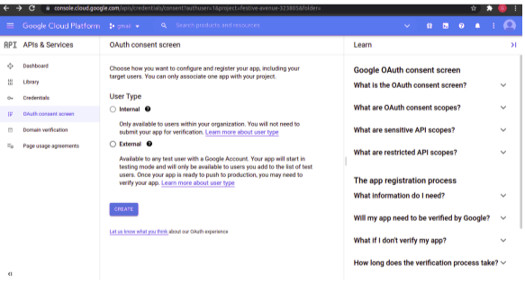
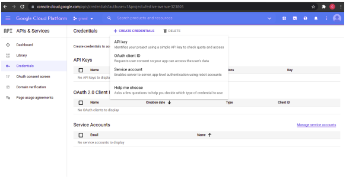
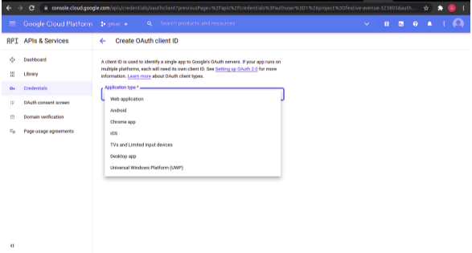
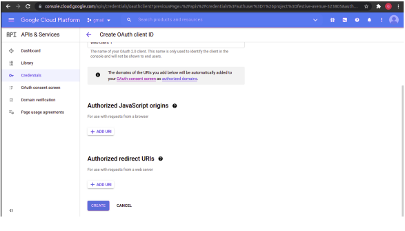
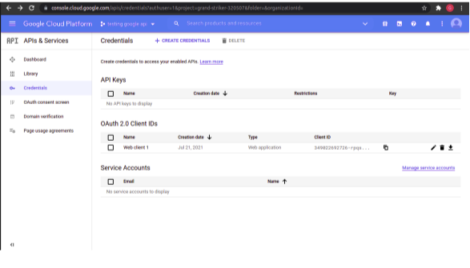
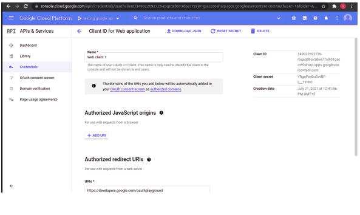

**Google Drive DB Upload**

1. Go to the Google API console to enable Drive api.

2. Select a project.

3. In the sidebar on the left, expand APIs & auth and select Dashboard

4. Click Enable APIs and services and select a Google Drive API and
Enable.

5. In the OAuth consent screen click External and create.

6. Give mandatory field like App Name, Email in OAuth Screen content and Save
and Continue. Complete all fields in it and click Back To Dashboard.

7. Click Credentials and create credentials that select OAuth Client ID.

8. Select Application type as Web application.

9. In Authorized redirect URIs, click ADD URI. In that add the redirect URI "https://developers.google.com/oauthplayground".

10. In Oauth 2.0 client IDS, You can see the Client ID name created select that.

11. By clicking the name in oauth 2.0 client ids you can find, on the right side you may be able to see Client ID and Client Secret. 

12. The code and requirement needed is also attached in this repo.

13. In code, paste the client ID and secret from credentials in the console.

14. visit https://developers.google.com/oauthplayground/ and click the setting
icon in top right corner and check Use your own Oauth credentials. Paste the
client ID and secret in respective fields.

`Note: The code will run only on or above Python 3.7.5 so I recommend to use Python version 3.8`

